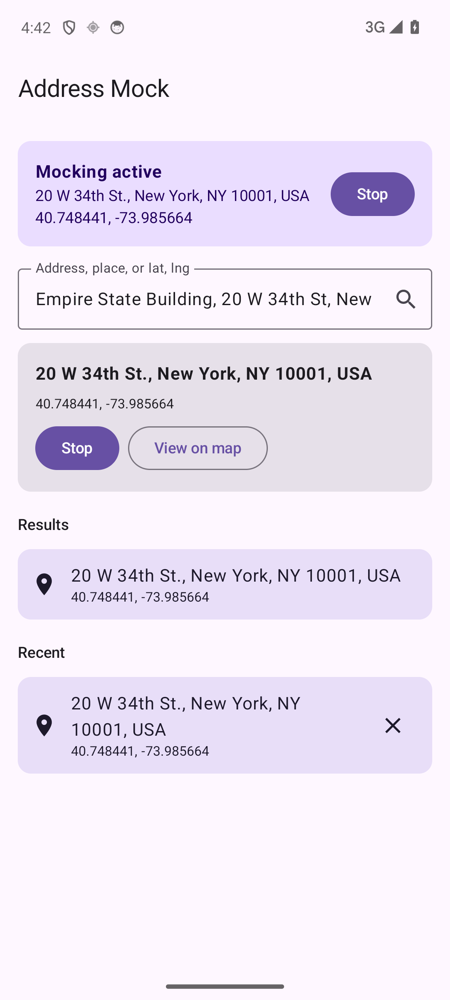

# Address Mock

Fake your Android location by typing in an address instead of dragging a pin around.

Apps like Fake GPS only let you pick a spot on a map, which gets annoying when you already know where you want to be. This one lets you search an address, place name, or `lat, lng`, then sets it as your mock location. You can also share a place from Google Maps straight into the app.



## Setup

1. Enable Developer options (tap Build number 7 times in About phone)
2. Install:
   ```bash
   ./gradlew installDebug
   ```
3. In Developer options, go to **Select mock location app** and pick **Address Mock**

Needs JDK 17 to build.

## Notes

- Addresses are looked up with the built-in Android geocoder, with OpenStreetMap (Nominatim) as a fallback
- It runs as a foreground service, so it keeps going in the background until you hit Stop
- It doesn't survive a reboot, so you'll need to start it again
- Apps can still tell the location is mocked if they check for it
